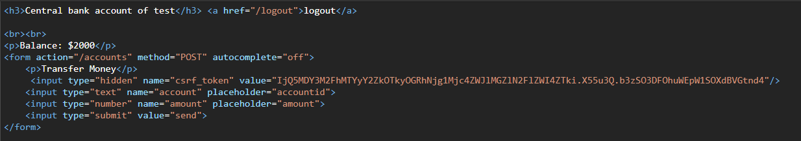

# What's up with CSRF?

The pandemic has increased our reliance on digital goods more than ever. It also has seen a huge increase in the number of cybercrimes. Without proper protection, one could be subject to cyber-attack incurring heavy damages. This article looks at one such attack, called `CSRF,` According to [Acunetix Web Application Vulnerability Report 2020](https://www.acunetix.com/acunetix-web-application-vulnerability-report/), CSRF vulnerabilities are becoming less common. However, they are still present in one in every three tested websites and web applications. It is important to know what CSRF is, what it can do, and how to protect web applications from CSRF.

## What is CSRF?

CSRF stands for Cross-Site Request Forgery. As the name suggests, the attack executes malicious code/script on the web application, which the user already authenticated. CSRF can be done using hidden forms in the HTML or using XMLHttpRequests, triggered by clicking buttons or submitting forms that claim to do something else.

TODO: need a bit better transition here. maybe explain the common way that attackers implement CSRF attacks and then relate it back to how much spam one receives...

Now, think of all the spam email you receive daily, was there a CSRF attack hiding in them?

A user who has authenticated using a browser cookie can be exploited by a hidden code that utilizes the same cookie to make changes to the servers' data. Generally, web browsers tend to include all the cookies associated with a website with each request. So when a malicious request is made from the same browser, the attack can easily make use of the stored values.

## Example for CSRF

We have a Flask app that mimics a banking application with the following specifications:

- Login form that keeps track of user sessions
- Account page that displays balance and a form to send money(login required)
- Logout button to clear the session.

We use Flask-login to manage user sessions. Let's see how each part of the application is defined.

> The server runs on http://localhost:5000

###  Homepage
  - On `GET` request, the application renders `templates/index.html`

  ```html
  # templates/index.html

  <form action='/' method='POST'>
    <input type='text' name='username' id='email' placeholder='username'/>
    <input type='password' name='password' id='password' placeholder='password'/>
    <input type='submit' name='submit' value='login'/>
  </form>
  ```

  - On `POST` request, the form is submitted, and the user credentials are validated. The application redirects to the `accounts` page (once logged in, `http://localhost:5000` will redirect to `accounts`)

  ```python
  # app.py

  @app.route("/", methods=["GET", "POST"])
  def homepage():
      if request.method == "POST":
          username = request.form.get("username")
          if request.form.get("password") == users.get(username):
              user = User()
              user.id = username
              flask_login.login_user(user)
              return redirect(url_for("accounts"))
      if flask_login.current_user.is_authenticated:
          return redirect(url_for("accounts"))
      return render_template("index.html")
  ```

    We use dummy data for account balance and login credentials.

  ```None
  users = {"test": "test"}

  BALANCE=2000
  ```

  Once logged in, the browser sends the cookie with each request made to the bank server. This is how the bank server identifies the active user and sends relevant data.

### Accounts

  This is where the CSRF attack happens. The accounts page displays user balance and a form
  for transactions.

  
  This page is rendered on `/accounts.`

  ```html
  <p>Balance: ${{balance}}</p>
  <form action="/accounts" method="POST">
    <p>Transfer Money</p>
    <input type="text" name="account" placeholder="accountid">
    <input type="number" name="amount" placeholder="amount">
    <input type="submit" value="send">
  </form>
  ```

  and the transactions are handled by

  ```python
  @app.route("/accounts", methods=["GET", "POST"])
  @flask_login.login_required
  def accounts():
      global BALANCE
      if request.method == "POST":
          amount = int(request.form.get("amount"))
          if amount >= BALANCE:
              BALANCE -= amount
      return render_template(
          "accounts.html", balance=BALANCE, username=flask_login.current_user.username
      )
  ```

  Nothing complex here. Just decrements the input amount once the form is submitted.

There is a form of trust between your web browser and the bank server. Once logged in, the bank server always sends you the required data. An attacker can exploit this form of trust by making us do some operation on the bank server without our knowledge.

You might have received, at some point in your life, spam emails saying that you've won the lottery or jackpot and follow their instruction to claim the award. This email takes you to some page that asks you to `click to claim.` But once you click, the page executes a hidden form in your browser that exploits the trust established between the bank and your browser.


```html
# hacker.html

<form hidden id="hack" target="csrf-frame" action="http://localhost:5000/accounts" method="POST">
    <input type="text" name="account" value="hackerid">
    <input type="number" name="amount" value="2000">
</form>
<iframe hidden name="csrf-frame"></iframe>
<h3>You won $100,000</h3>
<button onClick="hack();" id="button">Click</button> to claim
<br>
<div id="warning"></div>
<script>
    function hack() {
        document.getElementById("hack").submit();
        document.getElementById("warning").innerHTML="check you bank balance!";
    }
</script>
```


This is how the lottery page looks like. Nothing seems suspicious to ordinary eyes. But behind the scenes, there is a hidden form with `accountId` as `hackerid` and `amount` as `2000`. This runs in an `iframe` to avoid any page redirects. You `click` to claim, the code executes in the background, and the money is gone from your account.

## How to prevent CSRF?

CSRF can be prevented by using a CSRF-Token to validate each request. For unsafe requests like PUT, POST and DELETE must provide a valid CSRF Token since they can change the server state.

#### CSRF Token Workflow


1. The server sends a CSRF-Token, which is stored by the browser
1. The Client stores the CSRF-Token in the form of cookies or any other means
1. The Client includes the CSRF Token in every form as a hidden value and sends to Server
1. The Server validates the CSRF Token and accepts/rejects the request


Let's now see how to implement CSRF protection in our example app using `flask-WTF.` flask-WTF is a simple integration of Flask and WTForms, including CSRF, file upload, and reCAPTCHA.

In our app.py, instantiate a csrf object.

```python
# app.py

from flask import Flask
from flask_wtf.csrf import CSRFProtect

app = Flask(__name__)
app.secret_key = "csrf_in_action"

csrf = CSRFProtect()
csrf.init_app(app)
```

Now include the hidden input field in every form.

```html
<input type="hidden" name="csrf_token" value="{{ csrf_token() }}"/>
```

Done. This will take care of the CSRF for you. Now let's see if the attack is working. Here we try to steal money from a page that uses CSRF.


The server rejects the request because the CSRF Token is invalid.


Add a hidden field with some random value, this results in a invalid token authentication. We have successfully prevented the CSRF attack. When you submit the original form, it works because the CSRF Token is automatically populated in a hidden field.



## Conclusion

We have seen how an attacker can forge a request and perform operations that shouldn't be possible otherwise. We must secure all the forms using the CSRF token for security purposes. Not all people on the internet are accustomed to good practices, but as a developer, you need to make sure that the form/webpage is secure to all possible extend.
