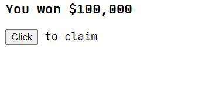
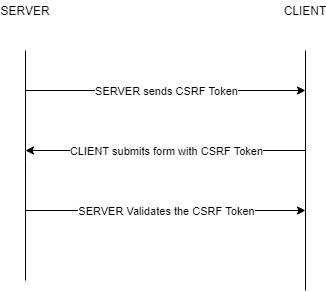

# CSRF Protection in Flask

This article looks at how to prevent [CSRF](https://en.wikipedia.org/wiki/Cross-site_request_forgery) attacks in Flask. Along the way, we'll look at what CSRF is, an example of a CSRF attack against a Flask app, and how to protect a Flask app against CSRF via Flask-WTF.

## What is CSRF?

CSRF, which stands for Cross-Site Request Forgery, is an attack against a web application in which the attacker attempts to trick an authenticated user into performing a malicious action. Most CSRF attacks target web applications that use cookie-based auth since web browsers include all of the cookies associated with a particular domain with each request. So when a malicious request is made from the same browser, the attacker can easily make use of the stored cookies.

Such attacks are often achieved by tricking a user into clicking a button or submitting a form. For example, say your banking web app is vulnerable to CSRF attacks. An attacker could create a clone of your banking web site that contains the following form:

```html
<form action="https://centralbank.com/api/account" method="POST">
  <input type="hidden" name="transaction" value="transfer">
  <input type="hidden" name="amount" value="100">
  <input type="hidden" name="account" value="999">
  <input type="submit" value="Check your statement now">
</form>
```

The attacker then sends you an email that appears to come from your bank -- cemtralbenk.com instead of centralbank.com -- indicating that your bank statement is ready to view. After clicking the link in the email, you're taken to the malicious web site with the form. You click the button to check your statement. The browser will automatically send the authentication cookie along with the POST request. Since you're authenticated, the attacker will be able to perform any action that you're allowed to do. In this case, $100 is transferred from you account to account number 999.

Think of all the spam emails you receive daily. How many of them contain hidden CSRF attacks?

## Flask Example

Next, let's look at an example of a Flask app that's vulnerable to CSRF attacks. Again, we'll use the banking web site example.

That app does has the following:

- Login form that keeps track of user sessions
- Account page that displays account balance and a form to send money
- Logout button to clear the session

It uses [Flask-Login](https://flask-login.readthedocs.io/en/latest/) for handling auth and managing user sessions.

You can clone down the app from the [csrf-flask-insecure](https://github.com/testdrivenio/csrf-example/tree/csrf-flask-insecure) branch of the [csrf-example](https://github.com/testdrivenio/csrf-example) repo. Follow the directions on the readme for installing the dependencies and run the app on [http://localhost:5000](http://localhost:5000):

```sh
$ python app.py
```

Make sure you can log in with:

- username: `test`
- password: `test`

After logging in, you'll be redirected to [http://127.0.0.1:5000/accounts](http://127.0.0.1:5000/accounts). Take note of the cookie:

TODO: add image

The browser will send the cookie with each subsequent request made to the `127.0.0.1:5000` domain. Take note of the route associated with the account page:

```python
@app.route("/accounts", methods=["GET", "POST"])
@login_required
def accounts():
    user = get_user(current_user.username)

    if request.method == "POST":
        amount = int(request.form.get("amount"))
        if amount <= user["balance"]:
            user["balance"] -= amount

    return render_template(
        "accounts.html",
        balance=user["balance"],
        username=current_user.username,
    )
```

Nothing complex here: On a POST request, the provided amount is decremented from the user's balance. When the user is authenticated, the bank server essentially trusts the request from the browser. Since the isn't protected from a CSRF attack, an attacker can exploit this trust by tricking someone into performing an operation on the bank server without their knowledge. This is exactly what the *hacker/index.html* pages does:

```html
<form hidden id="hack" target="csrf-frame" action="http://localhost:5000/accounts" method="POST" autocomplete="off">
    <input type="number" name="amount" value="2000">
</form>
<iframe hidden name="csrf-frame"></iframe>

<h3>You won $100,000</h3>
<button onClick="hack();" id="button">Click to claim</button>
<br>
<div id="warning"></div>

<script>
    function hack() {
        document.getElementById("hack").submit();
        document.getElementById("warning").innerHTML="check your bank balance!";
    }
</script>
```

You can serve up this page on [http://localhost:8002](http://localhost:8002) by navigating to the project directory and running the following command in a new terminal window:

```sh
$ python -m http.server --directory hacker 8002
```



Other than the poor design, nothing seems suspicious to ordinary eyes. But behind the scenes, there's a hidden form that executes in the background removing all the money from the user's account.

An attacker could email a link to this page disguised as some of prize giveaway. Now, after opening the page and clicking the "Click to claim" button, a POST request is sent to [http://localhost:5000/accounts](http://localhost:5000/accounts) that exploits the trust established between the bank and the web browser.

## How can you Prevent CSRF?

CSRF attacks can be [prevented](https://en.wikipedia.org/wiki/Cross-site_request_forgery#Prevention) by using a CSRF token -- a random, unguessable string -- to validate the request origin. For unsafe requests with side effects like an HTTP POST form submission, you must provide a valid CSRF token so the sever can verify the source of the request for CSRF protection.

### CSRF Token Workflow



1. The client sends a POST request with their credentials to authenticate
1. If the credentials are correct, the server generates a session and the CSRF token
1. The request is sent back the client, and the session is stored in a cookie while the token is rendered in a hidden form field
1. The client includes sends the session cookie and the token on form submission
1. The server validates the session and the CSRF token and accepts or rejects the request

Let's now see how to implement CSRF protection in our example app using the [Flask-WTF](https://flask-wtf.readthedocs.io/) extension.

Start by installing the dependency:

```sh
pip install Flask-WTF
```

Then, register [CSRFProtect](https://flask-wtf.readthedocs.io/en/stable/csrf.html?highlight=csrfprotect#csrf-protection) globally in *app.py*:


```python
from flask import Flask, Response, abort, redirect, render_template, request, url_for
from flask_login import (
    LoginManager,
    UserMixin,
    current_user,
    login_required,
    login_user,
    logout_user,
)
from flask_wtf.csrf import CSRFProtect

app = Flask(__name__)
app.config.update(
    DEBUG=True,
    SECRET_KEY="secret_sauce",
)

login_manager = LoginManager()
login_manager.init_app(app)

csrf = CSRFProtect()
csrf.init_app(app)

...

```

Now, by default, all POST, PUT, PATCH, and DELETE methods are protected against CSRF. Take note of this. You should never perform a side effect, like changing data in the database, via a GET request.

Next, include the hidden input field in yours forms.

*templates/index.html*:

```html
<form action='/' method='POST' autocomplete="off">
    <input type='text' name='username' id='email' placeholder='username'/>
    <input type='password' name='password' id='password' placeholder='password'/>
    <input type='submit' name='submit' value='login'/>
    <input type="hidden" name="csrf_token" value="{{ csrf_token() }}">
</form>
```

*templates/accounts.html*:

```html
<h3>Central bank account of {{username}}</h3> <a href="/logout">logout</a>

<br><br>
<p>Balance: ${{balance}}</p>
<form action="/accounts" method="POST" autocomplete="off">
    <p>Transfer Money</p>
    <input type="text" name="account" placeholder="accountid">
    <input type="number" name="amount" placeholder="amount">
    <input type="submit" value="send">
    <input type="hidden" name="csrf_token" value="{{ csrf_token() }}">
</form>
```

That's it. This will take care of CSRF for you. Now, let's see if this prevents the attack. Run both servers again. Log in to the banking app, and then try to "Click to claim" button. You should see a 400 error:

TODO: show error

What happens if you add the same hidden field to the form in *hacker/index.html*?

```html
<form hidden id="hack" target="csrf-frame" action="http://localhost:5000/accounts" method="POST" autocomplete="off">
    <input type="number" name="amount" value="2000">
    <input type="number" name="account" value="2">
    <input type="hidden" name="csrf_token" value="123">
</form>
```

It should still fail with a 400. We have successfully prevented the CSRF attack.

## Conclusion

We've seen how an attacker can forge a request and perform operations without the user's knowledge. As browsers become more secure, CSRF is becoming less and less of a concern. That said, it's still important to secure all routes that handle form submissions especially when it's easy to implement.

## TODOs

1. Briefly explain why CORS doesn't help mitigate CSRF for browser-based form submissions
1. CORS does help mitigate CSRF with JSON APIs though. Why?
1. So, if you don't support CORS and your APIs are strictly JSON, is there any reason to use CSRF tokens?
